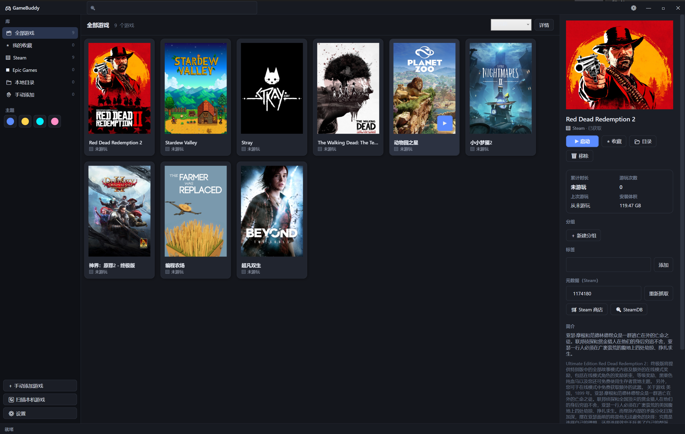

# GameBuddy — 本机单机游戏库启动器（WPF, .NET 10）

统一管理 Steam / Epic / 本地目录里的单机游戏：扫描入库、海报墙首页、一键启动、游玩计时与统计、搜索分组标签、可插拔主题。

- 技术栈：WPF on .NET 10（`net10.0-windows`）+ CommunityToolkit.MVVM + Microsoft.Extensions.Hosting（DI）
- 当前版本：**MVP（v0.1.0）**，功能闭环可跑，未做性能与大规模库的极限优化

---

## 1. 界面预览



主页库：左侧按分组 / 来源筛选（带计数），中间是竖版海报墙（悬停出现启动按钮），右侧是选中游戏的详情、游玩统计与元数据编辑。

## 2. 快速开始

```bash
# 构建整个解决方案（slnx 在仓库根，无需 cd）
dotnet build

# 运行（Windows）
dotnet run --project src/GameBuddy

# 跑测试
dotnet test
```

首次启动会自动扫描本机游戏，并从 Steam 商店接口补齐海报与简介（需要联网，国内网络若访问 Steam 较慢可在设置里关闭自动抓取）。

## 3. MVP 已实现的能力

| 模块 | 现状 |
| --- | --- |
| Steam 扫描 | 读注册表定位 Steam，解析 `libraryfolders.vdf`（支持多库）+ `appmanifest_*.acf`，自动剔除 Steamworks 运行库/Proton 等非游戏条目 |
| Epic 扫描 | 解析 `%ProgramData%\Epic\EpicGamesLauncher\Data\Manifests\*.item`，只取 `AppCategory=games` |
| 目录扫描 | 用户指定目录：根目录 exe + 子目录"主程序"启发式挑选（同名优先 > 体积最大），内置安装器/反作弊/运行库黑名单 |
| 首页库 | 竖版海报墙（2:3）、悬停显示启动按钮、来源角标、累计时长、收藏星标、空态引导 |
| 启动 | Steam `steam://rungameid/<appid>`、Epic `com.epicgames.launcher://...`、本地 exe 直启 |
| 游玩计时 | 启动即开会话；后台 4s 轮询按"安装目录/主程序路径"匹配进程，进程消失自动结束；支持手动停止；程序退出/崩溃会补全未结束会话 |
| 统计 | 累计时长、游玩次数、上次游玩时间（都来自本地会话记录） |
| 搜索 / 分组 / 标签 | 顶部实时搜索（名称/标签/类型）、侧边栏分组与来源筛选（带计数）、多分组勾选、标签增删 |
| 详情面板 | 大图海报、来源、时长统计、分组、标签、Steam AppId 手动纠正与重新抓取、Steam 商店 / SteamDB 跳转、简介与开发发行信息 |
| 元数据来源 | Steam Store 官方公开接口 `appdetails` + `storesearch`（无需 API Key）；非 Steam 游戏按名称搜索匹配，可在详情里手动填 AppId 纠正 |
| 主题 | 内置 4 套（暗黑默认 / 像素 / 赛博朋克 / 可爱卡通）+ 外部主题插件目录热加载，运行时切换无需重启 |
| 持久化 | `%LOCALAPPDATA%\GameBuddy\library.json`（库/分组/会话/设置），海报缓存到 `cache\posters` |

## 4. 目录结构

```
gamebuddy/
├── GameBuddy.slnx                  解决方案（放仓库根，根目录可直接 dotnet build / dotnet test）
├── README.md                       设计说明 + 上手
├── .gitignore
├── screenshots/
│   └── screenshot.png              README 里引用的界面预览图（主页库 + 详情面板）
├── samples/
│   └── themes/retro-console/       外部主题插件示例（theme.json + Theme.xaml）
├── src/
│   └── GameBuddy/                  WPF 应用（唯一的产出程序集）
│       ├── GameBuddy.csproj
│       ├── App.xaml(.cs)           DI 装配、启动/退出流程、全局异常兜底
│       ├── Models/                 Game / PlaySession / GameGroup / LibrarySettings / ThemeDescriptor
│       ├── Services/               业务层（不依赖具体 View）
│       │   ├── Scanning/           SteamScanner / EpicScanner / FolderScanner / VdfParser
│       │   ├── Metadata/           SteamStoreMetadataProvider（节流 + 429 退避）/ ImageCacheService
│       │   ├── Storage/            JsonLibraryRepository / AppPaths
│       │   ├── Theming/            ThemeService（内置 pack URI + 外部松散 XAML）
│       │   ├── LibraryService.cs   扫描→合并→抓元数据的业务门面
│       │   ├── GameLauncher.cs     启动 / 打开目录 / 打开商店与 SteamDB
│       │   ├── PlaySessionTracker.cs  会话与进程轮询计时
│       │   └── Diagnostics/        AppLog
│       ├── ViewModels/             MainViewModel（库/筛选/命令）、GameItemViewModel（单卡状态）
│       ├── Views/                  只放真正的视图：MainWindow / DetailsPanel / SettingsPanel
│       ├── Converters/             可见性 / 时长 / 体积格式化
│       └── Resources/
│           ├── Themes/             Dark / Pixel / Cyberpunk / Cute（内置主题）
│           ├── Templates/          GameCardTemplate 等数据模板（不是 View，不放在 Views 下）
│           └── Styles/Controls.xaml  全局控件样式（全部 DynamicResource 引用主题键）
└── tests/
    └── GameBuddy.Tests/            xunit：VDF 解析、Steam / Epic / 目录扫描器
        ├── GameBuddy.Tests.csproj
        ├── VdfParserTests.cs
        └── ScannerTests.cs
```

**分层约定**：`Views` 只负责绑定与视觉，业务逻辑在 `Services`，`ViewModels` 做状态与命令编排；`Models` 是纯数据（除 `ThemeDescriptor` 为切换高亮需要通知外不带任何逻辑）。跨层禁止反向引用（Services 不认识 ViewModels）。

**测试**：`dotnet test`，共 10 个用例，都在 `tests/GameBuddy.Tests`：

- `VdfParserTests` —— 锁住"根对象名必须保留（`AppState` / `libraryfolders`）"这条回归（早期实现把根键吞掉，导致 Steam 扫描恒返回 0），另外覆盖键大小写不敏感、注释与嵌套对象。
- `ScannerTests` —— 用临时目录搭一个假 Steam 库：验证跨库扫描、运行库/Proton/残留清单被剔除、`steam://rungameid/` 与安装路径正确；`FolderScanner` 验证主程序挑选与安装器黑名单。

## 5. 关键设计说明

**MVVM 与数据流**：View 只做绑定，业务逻辑全在 Service / ViewModel；`MainViewModel` 持有 `Games`（`ObservableCollection<GameItemViewModel>`）并对外暴露 `ICollectionView`，筛选、排序都由 `CollectionView` 的 `Filter` / `SortDescriptions` 完成，避免反复重建集合。

**合并策略**：扫描结果以 `Source + ExternalId` 作为唯一键做 upsert —— 已存在的只更新安装信息，保留用户改过的分组/标签/收藏，重复扫描不会丢数据。

**元数据抓取**：Steam storefront 接口有频率限制，Provider 内部用信号量 + 1.1s 最小间隔节流，遇到 429 按 5s/10s/15s 退避；图片走本地缓存（URL 哈希命名），重复启动不再请求 CDN。

**计时原理**：启动游戏时落一条 `PlaySession`（`EndedAt=null`），后台轮询进程：命中则刷新"最后见到"时间，连续 20s 未命中且曾确认过 → 结束会话；从未确认且超过 15 分钟 → 判为未真正启动。这样既适用于本地 exe，也能覆盖 Steam/Epic 协议启动（拿不到子进程 PID）的场景。

**主题插件**：内置主题是编译进程序集的 `ResourceDictionary`（`pack://...` 加载），外部主题是运行时加载的松散 XAML（`ResourceDictionary.Source = 文件绝对路径`）。切换时从 `Application.Resources.MergedDictionaries` 摘掉旧字典、挂上新字典；所有样式只通过 `DynamicResource` 引用主题键，因此切换即时生效。

插件格式：把文件夹放到 `%LOCALAPPDATA%\GameBuddy\Themes\<id>\`，内含

```json
{
  "id": "retro-console",
  "name": "复古终端",
  "description": "黑底绿字 CRT 风",
  "author": "...",
  "xamlFile": "Theme.xaml",
  "previewColorHex": "#33FF66"
}
```

`Theme.xaml` 必须提供下列资源键（缺键不会崩，但会退化为无样式）：

| 类别 | 键 |
| --- | --- |
| 背景 | `Theme.WindowBackgroundBrush`、`Theme.SidebarBrush`、`Theme.TopBarBrush`、`Theme.SurfaceBrush`、`Theme.CardBrush`、`Theme.CardHoverBrush`、`Theme.SelectionBrush` |
| 描边 | `Theme.BorderBrush`、`Theme.DividerBrush`、`Theme.CardBorderThickness`（**必须是 `Thickness`**） |
| 强调 | `Theme.AccentBrush`、`Theme.AccentHoverBrush`、`Theme.AccentTextBrush`、`Theme.GlowBrush` |
| 文本 | `Theme.TextPrimaryBrush`、`Theme.TextSecondaryBrush`、`Theme.TextMutedBrush` |
| 状态 | `Theme.SuccessBrush`、`Theme.WarningBrush`、`Theme.DangerBrush`、`Theme.PlaceholderBrush` |
| 形状字体 | `Theme.CardCornerRadius`、`Theme.ButtonCornerRadius`、`Theme.PosterCornerRadius`、`Theme.ControlCornerRadius`、`Theme.BaseFontFamily`、`Theme.TitleFontFamily` |
| 其他 | `Theme.CardPadding`（Thickness）、`Theme.CardEffect`、`Theme.PanelEffect`（DropShadowEffect） |

## 6. 已知限制（MVP 范围内有意保留）

- 海报墙用 `WrapPanel`，**未做 UI 虚拟化**；几十款游戏没问题，上千款需要换成虚拟化面板。
- 只实现了 Steam 单一元数据源；IGDB / SteamGridDB 等多源与"选封面"未做。
- 目录扫描是启发式的，可能把工具程序误判为游戏（可在库里移除或隐藏）。
- 计时只统计"从本启动器启动"的会话；直接用 Steam 启动不会计入。
- 单元测试目前只覆盖**扫描与解析层**（`tests/GameBuddy.Tests`）；ViewModel（依赖 WPF 的 `ICollectionView`/`Dispatcher`）与主题切换还没有测试。
- 解决方案用的是 .NET 10 默认的 `.slnx` 格式，老版本 Visual Studio 可能只认 `.sln`。

## 7. 下一步路线（建议顺序）

1. **P1**：虚拟化列表 + 增量扫描 + 海报懒加载；补 ViewModel / 主题切换层测试。
2. **P1**：启动器自启动/最小化到托盘、游戏中浮窗（显示本次时长）。
3. **P2**：多封面来源与手动选图、封面本地文件拖拽；数据库（SQLite）替换 JSON 以支持更大规模。
4. **P2**：分组排序拖拽、标签自动补全、隐藏/家长锁。
5. **P3**：云同步库与统计数据、更多主题（玻璃拟态/复古 CRT）、插件市场。
